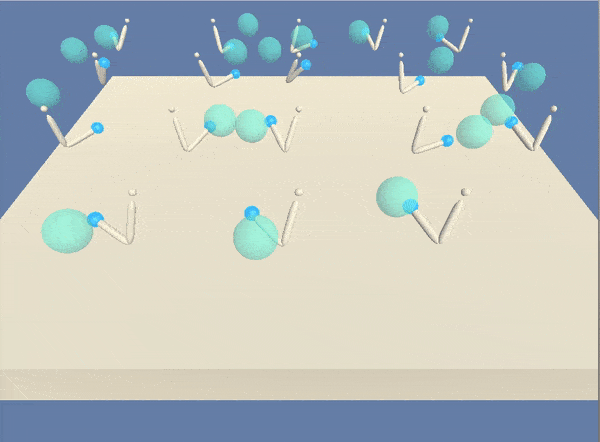

# Unity Reacher Navigation
The repository contains an implementation of DDPG (Deep Deterministic Policy Gradient) as published in the original paper [Continuous control with deep reinforcement learning](https://arxiv.org/abs/1509.02971).
The aim is to train a double jointed arm to catch as many objects as possible.
A wide description of the Reacher Unity environments is on [Unity ML-Agents Toolkit](https://github.com/Unity-Technologies/ml-agents).



## Descritpion of the environment

The state space has 33 dimensions and contains the position, rotation, velocity, and angular velocities of the arms.

Each action is a vector with four numbers, corresponding to torque applicable to two joints. Every entry in the action vector should be a number between -1 and 1

Two versions of the Unity Reacher Environment are availble

- The first one contains just one single agent
- The second one contains 20 different agents

In this porject we use the second one. Thanks to this version we can train the 20 agents in parallel sharing the experiences collected in a memory buffer. 
 A reward of +0.1 is provided for each step that the agent's hand is in the goal location. Thus, the goal of your agent is to maintain its position at the target location for as many time steps as possible.

## Files provided

- **Continuos_control.ipynb** is the main python notebook which contains the main loop to train the DDPG agents
- **ddpg_20agents.py** is the implementation of the 20 DDPG agents
- **model.py** contains both the actor neural network and the critic neural network
- **checkpoint_actor.pth** and **checkpoint_critic.pth** which contain the model weights of a successful actor and critic network
- To run the code properly a **python** folder is provided. The project environment is similar to, but not identical to the Reacher environment on the [Unity ML-Agents GitHub page](https://github.com/Unity-Technologies/ml-agents). This folder, provided by the [Reinforcement Learning Nanodegree progam of **Udacity**]( https://www.udacity.com/course/deep-reinforcement-learning-nanodegree--nd893), there are all the files needed for the installation of the Unity environments. 
- The **report.pdf** describes the details of the implementation and more ideas about the DDPG algorithm.

## Requirements and installation

To run the notebook **Navigation.ipynb** it firstly needs to set up the environment as follows:

- Create (and activate) a new kernel with Python 3.6
    - **Linux** or **Mac**
   ```
   conda create --name drlnd python=3.6
   source activate drlnd
    ```  
    - **Windows**
   ```
    conda create --name drlnd python=3.6
    activate drlnd
   ```

- If you didn't before, you need a minimal install of OpenAI gym
```
pip install gym
pip install gym[classic_control]
pip install gym[box2d]
```

- Clone the repository, and navigate to the python/ folder. Then, install several dependencies.
```
git clone https://github.com/udacity/deep-reinforcement-learning.git
cd deep-reinforcement-learning/python
pip install .
```

- Create an IPython kernel for the dqn environment.
```
python -m ipykernel install --user --name drlnd --display-name "drlnd"
```

- Download the Unity Environment which matches your operating system
    - [Linux](https://s3-us-west-1.amazonaws.com/udacity-drlnd/P2/Reacher/Reacher_Linux.zip)
    - [Mac](https://s3-us-west-1.amazonaws.com/udacity-drlnd/P2/Reacher/Reacher.app.zip)
    - [Windows (32bit)](https://s3-us-west-1.amazonaws.com/udacity-drlnd/P2/Reacher/Reacher_Windows_x86.zip)
    - [Windows (64bit)](https://s3-us-west-1.amazonaws.com/udacity-drlnd/P2/Reacher/Reacher_Windows_x86_64.zip)

and unzip in a folder of your choice

- Then you can finally open the **Continuos_Control.ipynb**. Before running code in this notebook
    - change the kernel to match the drlnd environment by using the drop-down Kernel menu
    
    
 
    - In the following line
    ```
    env = UnityEnvironment(file_name="...")
    ```
    change the folder path where you installed the Reacher unity environment.
